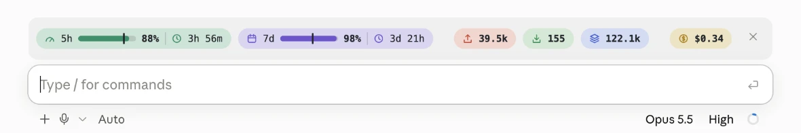
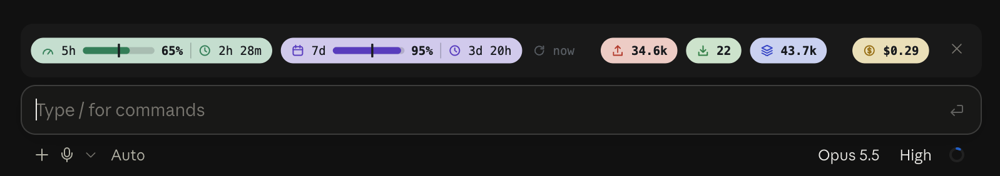
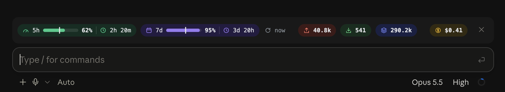

# claude-code-usage-bar

[](LICENSE)

English | [中文](README.zh.md)

`usage-bar` is a Claude Code mod that draws a usage bar above the prompt: what is left of the 5-hour and 7-day rate-limit windows, this session's tokens, and its cost.





Both show the default palette. A darker one is chosen with the [`theme` option](#configuration).

> **Early access.** Claude Code's mod (function hooks) API may change between releases, and a Claude Code update can break this mod. See [Requirements](#requirements) for what it has been used on.

## Requirements

- Claude Code with mods (function hooks) available. Written against 2.1.288.
- Used only on the macOS desktop app. In a terminal the bar is one line of text. Windows, Linux, the VS Code extension and the mobile app are untested.
- A Claude subscription for the `5h` and `7d` windows. Without one Claude Code reports no rate-limit windows and both show `--`.

## Install

```bash
git clone https://github.com/kaicodedocument/claude-code-usage-bar ~/.claude/mods/usage-bar
```

Name the folder in the `env` block of `~/.claude/settings.json`, then start a new session:

```json
{
  "env": {
    "CLAUDE_CODE_PLUGIN_DIRS": "~/.claude/mods/usage-bar"
  }
}
```

If the variable already names other folders, add this one after a `:` (`;` on Windows).

To try it in one terminal session only:

```bash
claude --plugin-dir ~/.claude/mods/usage-bar
```

## Update and uninstall

To update, pull and start a new session:

```bash
git -C ~/.claude/mods/usage-bar pull
```

To uninstall, remove `CLAUDE_CODE_PLUGIN_DIRS` (or this folder from it) and any `pluginConfigs["usage-bar"]` entry from `~/.claude/settings.json`, then delete the folder. Sessions already open keep the bar until they are restarted.

## What it shows

| Item | Meaning |
| --- | --- |
| `5h`, `7d` | Allowance left in the window, as a bar and a percentage |
| Vertical mark on the bar | Share of the window's time that is left. Fill past the mark means the allowance is lasting longer than the clock |
| Clock | Time until the window resets |
| Refresh mark | How long ago the two percentages were read. See [When it updates](#when-it-updates) |
| Up arrow | Input tokens this session: uncached input plus cache writes (see `countCacheWrites`) |
| Down arrow | Output tokens this session |
| Layers | Tokens read from the prompt cache this session |
| Coin | Session cost in US dollars, as `/cost` totals it |

The bar turns orange at 30% left and red at 10% left. A reading older than 10 minutes is drawn faded. All three are [configurable](#configuration).

## Configuration

Options are read from `pluginConfigs` in `~/.claude/settings.json`, keyed by the mod's name. All are optional; a new session picks up a change.

```json
{
  "pluginConfigs": {
    "usage-bar": {
      "options": {
        "theme": "dark",
        "staleMinutes": 10,
        "warnBelow": 30,
        "dangerBelow": 10,
        "countCacheWrites": true,
        "showUpdated": true
      }
    }
  }
}
```

| Option | Default | Meaning |
| --- | --- | --- |
| `theme` | `"light"` | `"light"` or `"dark"` pill colors. The mod cannot read the app's theme, so set the one that matches |
| `staleMinutes` | `10` | A rate-limit reading older than this is drawn faded |
| `warnBelow` | `30` | Percent left at which a window's bar turns orange |
| `dangerBelow` | `10` | Percent left at which a window's bar turns red |
| `showUpdated` | `true` | Show how long ago the rate-limit reading was taken, after the `7d` pill |
| `countCacheWrites` | `true` | `true`: the up arrow is uncached input plus cache writes. `false`: it is uncached input alone, and cache writes are counted with cache reads |

With `"theme": "dark"`:



## Hide and show

- Press `×` at the right end of the bar to hide it. Hidden, it takes no space.
- Type `/usage-bar` to show it again, or to toggle.

The choice lasts for the session; a new session starts with the bar shown.

## When it updates

The mod never queries Anthropic's servers. Claude Code hands it the rate-limit figures that came back with the last model response, and each figure on the bar refreshes on its own trigger:

| Figure | Updates |
| --- | --- |
| `5h` / `7d` percentage and bar | When a model response comes back in this session, or within about a minute of one coming back in any other local session |
| Reading age (the refresh mark after `7d`) | Every 60 seconds; back to `now` when a new reading arrives |
| Reset countdown and the vertical mark | Every 60 seconds, from the clock |
| Token counts | At the end of each turn in this session |
| Cost | At the end of each turn in this session |

### The reading age

The mark after the `7d` pill says how long ago the percentages were read: `now` under a minute, then `3m`, `1h 5m` and so on. It is the quickest way to tell whether the percentages can be trusted.

- `now` or a few minutes: the percentages are current.
- More than 10 minutes (the `staleMinutes` option): the percentages are also drawn faded.
- `--`: there is a reading but its time is unknown, which happens in a session that has not had a response of its own yet and found none shared by another session.

Set `showUpdated` to `false` to leave the mark out.

### What this means in practice

- **One session in use.** Its percentages update after every reply, so they are at most one turn old.
- **Several sessions open.** Whenever any of them gets a reply, the others pick up the new percentages within about a minute, without sending anything.
- **Every session idle.** Nothing updates. The reading age keeps counting up and the percentages fade after 10 minutes. The countdown keeps moving, because it comes from the clock.
- **Usage outside Claude Code.** What you use on claude.ai or the mobile app is not seen until a local session gets its next reply.
- **A window resets while idle.** The bar still shows the percentage from before the reset, faded, until the next reply. The true figure is then close to 100% left.

To refresh on demand, send any message in any local session.

## Troubleshooting

**The bar does not appear.** Sessions read the setting when they start, so open a new session; restart the app if a new session still has none. Check that the path in `CLAUDE_CODE_PLUGIN_DIRS` is the folder holding `.claude-plugin/`. `claude --debug` logs a line starting `usage-bar:` when the mod fails to load.

**Everything shows `--` or `0`.** No model response has come back yet in this session. Send a message.

**The percentages are faded.** The reading is more than 10 minutes old. It refreshes on the next response in any local session.

**The numbers differ from Settings > Usage.** The bar shows what is left, Settings shows what is used. The bar's figure is the one the last model response carried, rounded to a whole percent, so it lags a live query.

## Limits

- The rate-limit figures come from the last model response, not from a live query. Sessions share their latest reading through the mod's store and pick it up within a minute, but usage on claude.ai or the mobile app is not seen until a local session gets a response.
- Token counts start when the mod loads; turns before that are not counted.
- The mod cannot detect the app's theme; the dark palette is chosen by hand with the `theme` option.
- Individual colors are not configurable; the two palettes are constants in `hooks/bar.ts`.

## Develop

```bash
claude plugin validate .
CLAUDE_CODE_ENABLE_FUNCTION_HOOKS=1 claude plugin test .
```

`hooks/register.tsx` holds the behavior, `hooks/bar.ts` the drawing and number formats. Changes are listed in [CHANGELOG.md](CHANGELOG.md).

## License

[MIT](LICENSE)
